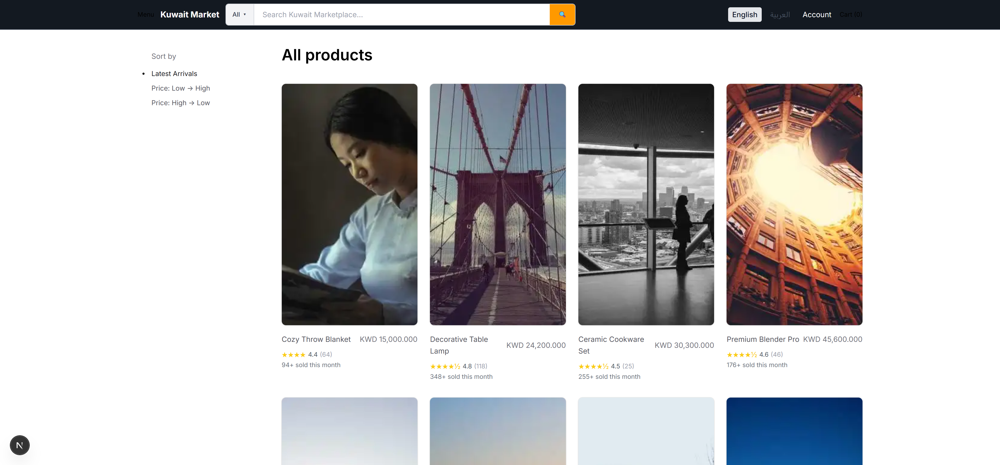
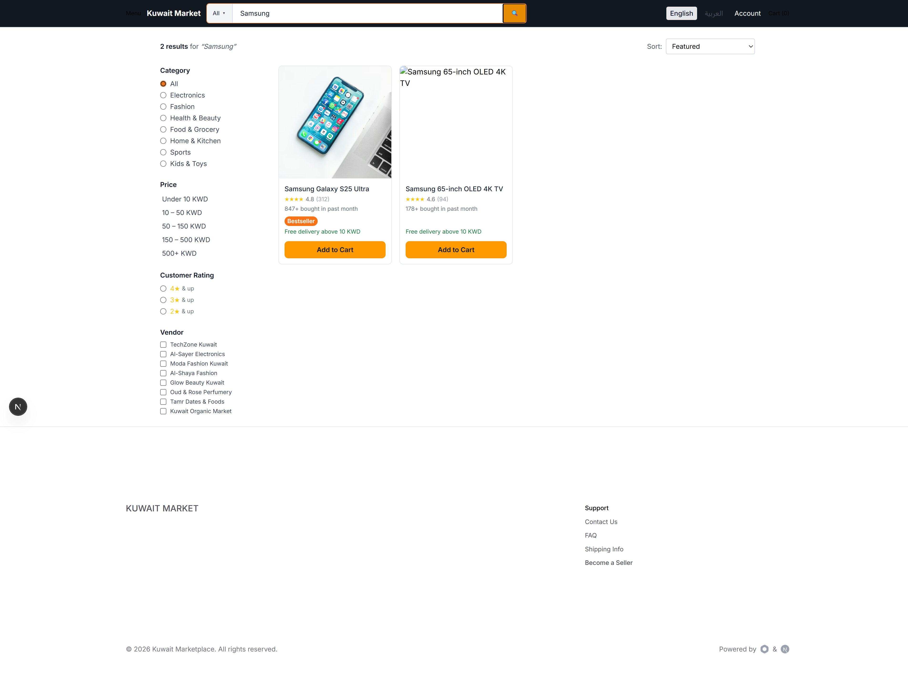
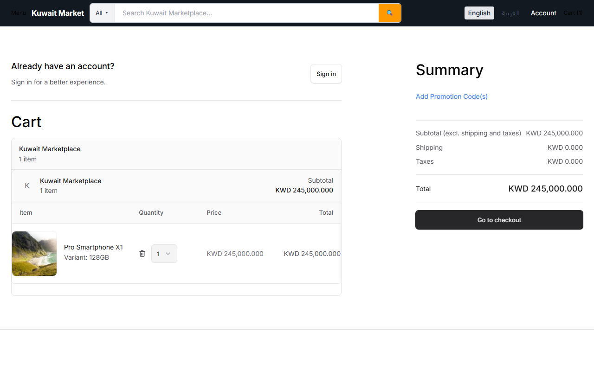
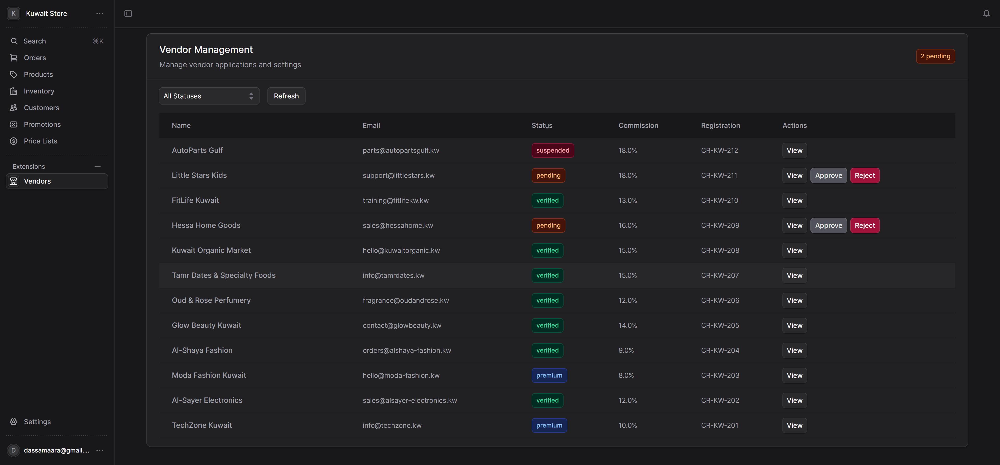
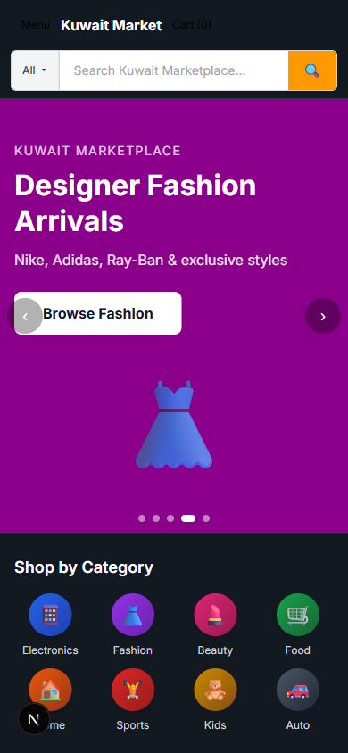

# Kuwait Marketplace

**🌐 Live demo:** https://kuwait-marketplace.netlify.app


A multi-vendor e-commerce platform built for the Kuwait market. Two-tier architecture: a Medusa v2 backend (commerce engine + admin) and a Next.js 15 storefront, glued together with Docker Compose for local development.

## Architecture

```
+----------------------+         +-----------------------+
|  storefront/         |  HTTP   |  backend/             |
|  Next.js 15 (App     +-------->+  Medusa v2 (Node/TS)  |
|  Router, TS, /kw     |         |  Admin + Store APIs   |
|  locale prefix)      |         |  Vendor module        |
+----------------------+         +----------+------------+
                                            |
                                  +---------+---------+
                                  |                   |
                            +-----v-----+      +------v-----+
                            | Postgres  |      |   Redis    |
                            +-----------+      +------------+
```

- **`backend/`** - Medusa v2 commerce engine. Custom modules for vendors and OTP auth, Stripe payment provider, AWS S3 file storage, SendGrid notifications.
- **`storefront/`** - Next.js 15 (App Router) shopper UI. Localized under `/kw`, server components, semantic search, account pages, cart and checkout.
- **`docker/`, `docker-compose.yml`, `docker-compose.dev.yml`** - Postgres + Redis + service orchestration for local dev.

## Tech Stack

| Layer        | Stack                                                              |
|--------------|--------------------------------------------------------------------|
| Backend      | Medusa v2, TypeScript, Node.js, PostgreSQL, Redis                  |
| Storefront   | Next.js 15 (App Router), React, TypeScript, Tailwind CSS           |
| Auth         | Google OAuth, Twilio SMS OTP                                       |
| Payments     | Stripe                                                             |
| Storage      | AWS S3 (product images, vendor assets)                             |
| Email        | SendGrid                                                           |
| Infra (dev)  | Docker Compose                                                     |

## Features

- Multi-vendor storefront: vendor registration, vendor admin, per-vendor product catalogs
- Localized routing under `/kw` with i18n setup
- Product detail with image gallery, reviews, social-proof badges
- Search with autocomplete and results page
- Customer accounts: profile, addresses, orders
- Mobile-responsive layouts
- Seeded demo data (products, vendors, inventory) for end-to-end demos

## Getting Started

### Prerequisites
- Node.js 20+
- Docker Desktop
- npm

### 1. Clone and configure env

```bash
git clone https://github.com/Samaara-Das/Ecom-site.git
cd Ecom-site
cp backend/.env.template backend/.env
cp storefront/.env.template storefront/.env.local
```

Edit each `.env` file with real values (see env var reference below).

### 2. Start Postgres + Redis

```bash
docker-compose -f docker-compose.yml -f docker-compose.dev.yml up -d db redis
```

### 3. Run the backend (port 9000)

```bash
cd backend
npm install
npx medusa db:migrate
npx medusa exec ./src/scripts/seed.ts        # seed regions, products
npm run dev
```

Admin panel: http://localhost:9000/app

### 4. Run the storefront (port 8000)

```bash
cd storefront
npm install
npm run dev
```

Storefront: http://localhost:8000/kw

## Environment Variables

### `backend/.env`
- `DATABASE_URL` - Postgres connection string
- `REDIS_URL` - Redis connection string
- `JWT_SECRET` - 32+ char secret for auth tokens
- `COOKIE_SECRET` - 32+ char secret for session cookies
- `STORE_CORS`, `ADMIN_CORS`, `AUTH_CORS` - allowed origins
- `STRIPE_API_KEY`, `STRIPE_WEBHOOK_SECRET` - Stripe payments
- `S3_FILE_URL`, `S3_ACCESS_KEY_ID`, `S3_SECRET_ACCESS_KEY`, `S3_REGION`, `S3_BUCKET`, `S3_ENDPOINT` - AWS S3 storage
- `SENDGRID_API_KEY`, `SENDGRID_FROM` - SendGrid email
- `GOOGLE_CLIENT_ID`, `GOOGLE_CLIENT_SECRET` - Google OAuth
- `TWILIO_ACCOUNT_SID`, `TWILIO_AUTH_TOKEN`, `TWILIO_FROM_NUMBER` - SMS OTP

### `storefront/.env.local`
- `MEDUSA_BACKEND_URL` - backend API URL
- `NEXT_PUBLIC_MEDUSA_PUBLISHABLE_KEY` - storefront publishable key
- `NEXT_PUBLIC_BASE_URL` - storefront base URL
- `NEXT_PUBLIC_DEFAULT_REGION` - ISO-2 default region (e.g. `kw`)
- `NEXT_PUBLIC_STRIPE_KEY` - Stripe publishable key
- `REVALIDATE_SECRET` - Next.js on-demand revalidation secret
- `MEDUSA_CLOUD_S3_HOSTNAME`, `MEDUSA_CLOUD_S3_PATHNAME` - image optimization

## Demo Screenshots

A selection from `demo-screenshots/`:

| | |
|---|---|
|  |  |
|  |  |
|  |  |

## Repository Layout

```
backend/                  # Medusa v2 backend
storefront/               # Next.js 15 storefront
docker/                   # Dockerfiles
docker-compose.yml        # Postgres, Redis, services
docker-compose.dev.yml    # Dev overrides
demo-screenshots/         # Verified UI screenshots
docs/                     # Implementation guide and design notes
scripts/                  # Utility scripts
```

## Deployment Notes

- **Storefront** -> Vercel (Next.js native target).
- **Backend** -> Railway or Render with managed Postgres + Redis add-ons.
- See `docs/IMPLEMENTATION_GUIDE.md` for deeper architecture and contribution patterns.